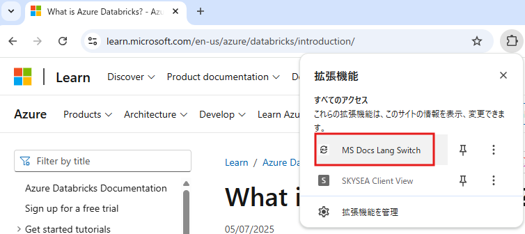
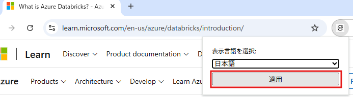
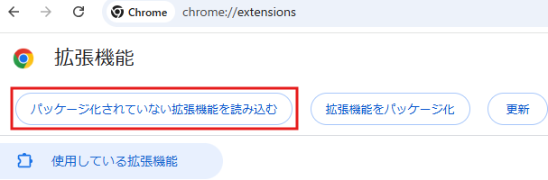
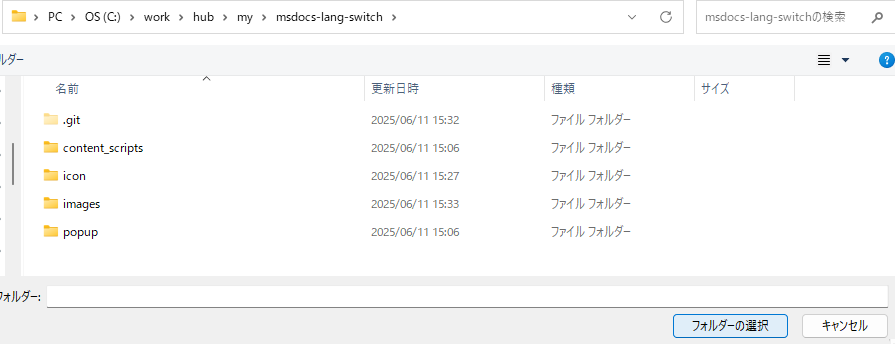

# msdocs-lang-switch

## How to use

1. [MS Learn](https://learn.microsoft.com/en-us/azure/databricks/introduction/) にアクセスし、拡張機能のボタンをクリック
     

2. 英語⇔日本語で切り替えられる
     

## How to install

1. `git clone git@github.com:Kubota-Yoshiharu/msdocs-lang-switch.git` でソースコードをクローン

2. 「パッケージ化されていない拡張機能を読み込む」
      

3. git clone した先のフォルダを選択
     

## Sample URL

- <https://learn.microsoft.com/en-us/azure/databricks/introduction/>
- <https://learn.microsoft.com/ja-jp/azure/databricks/introduction/>
